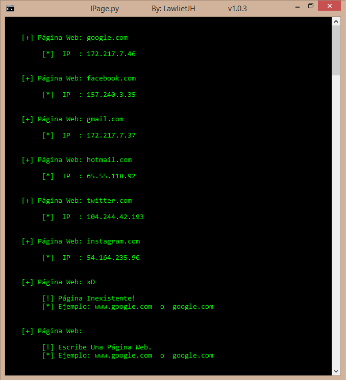
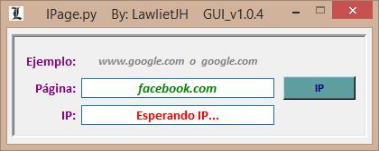
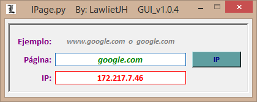

# IPage
## Obten la IP de cualquier Página Web.

- - -

- - -

* Version = 1.0.3
* Version GUI = 1.0.4

### Modo de Uso:

 * Escribe el Nombre de Cualquier Página y Precionar Enter, Ejemplos:

     * www.google.com
     * google.com
     
 * Para Cerrar El Script Precionar: 'Ctrl + C'

### Captura:

### Modo de Uso [GUI]:

  * Escribe el Nombre de Cualquier Página y Precionar El Boton 'IP'.

### Capturas:

